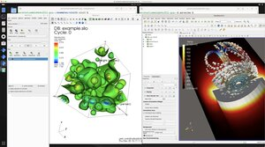
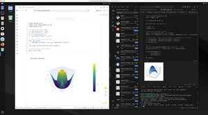
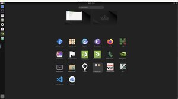
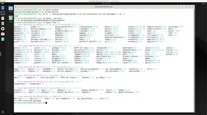
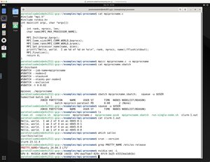
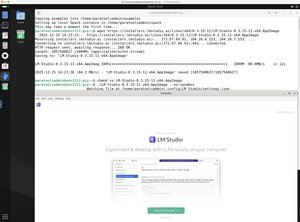
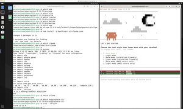
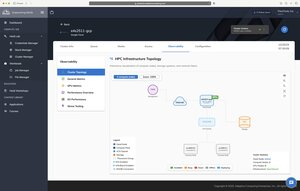
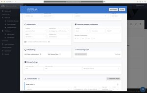

<!--- --8<-- "README.md" --->

# ParaTools Pro for E4S™

{ align=right width=600 }

The Extreme-scale Scientific Software Stack [(E4S™)][1] is a broad collection of HPC focused [software packages][2]. E4S provides a unified computing environment for deployment of open-source projects. E4S includes contributions from many organizations, including national laboratories, universities, and industry. E4S packages are deployed and managed via [Spack][3]. E4S was originally developed to provide a common software environment for the exascale leadership computing systems currently being deployed at DOE National Laboratories across the U.S.

ParaTools Pro for E4S™ takes E4S and deploys it to virtual machines and containers that are hardened and optimized for use on commercial clouds. It adds additional valuable features such as enhanced MPI performance, a performant remote desktop interface, and extra, optimized software packages for a variety of AI and other HPC applications. ParaTools Pro for E4S™ also adds deployment and development support from ParaTools, Inc.

[1]: https://www.e4s.io
[2]: https://e4s-project.github.io/DocPortal.html
[3]: https://github.com/spack/spack

ParaTools Pro for E4S™ is supported by the U.S. Department of Energy's SBIR program.

## Supported Cloud Providers

ParaTools Pro for E4S™ is available on multiple cloud platforms, each with comprehensive deployment guides and documentation:

| Cloud Provider | ParaTools Pro for E4S™ Marketplace Image | Documentation |
|----------------|------------------------------------------|---------------|
| **Amazon Web Services (AWS)** | [AWS Parallel Cluster](https://aws.amazon.com/marketplace/pp/prodview-xprkx44kyqgp6) | [Getting Started: AWS Parallel Cluster](AWS/getting-started-AWS.md) |
|  | [AWS Parallel Computing Service (PCS)](https://aws.amazon.com/marketplace/pp/prodview-xprkx44kyqgp6) | [Getting Started: AWS PCS](AWS/getting-started-AWS-PCS.md) |
| **Google Cloud Platform (GCP)** | [Google Cluster Toolkit](https://console.cloud.google.com/marketplace/product/paratools-public/paratools-pro-for-e4s-on-googleclustertoolkit-amd64) | [Getting Started: Google Cluster Toolkit](GCP/getting-started-GCP.md) |
| **Microsoft Azure** | Azure HPC | [Getting Started](Azure/getting-started-Azure.md) |
| **[Heidi][heidi]** | Adaptive Computing AI Supercomputing | [Getting Started](Heidi/getting-started-Heidi.md) |

[heidi]: https://adaptivecomputing.com/heidi-ai-supercomputing/

Each platform provides optimized configurations for high-performance computing workloads with E4S software packages.

## Gallery

Browse screenshots showcasing the features and capabilities of ParaTools Pro for E4S™. Click on any thumbnail to view the full-resolution image.

### ParaTools Pro for E4S™ Heidi variant on GCP

  
  
<strong>Visualization Tools</strong>

  
VisIt and ParaView for scientific visualization

  
  
<strong>Marimo Interactive Notebooks</strong>

  
Reactive Python notebooks for data science

  
  
<strong>BioNeMo AI Framework</strong>

  
Drug discovery and biomolecular simulation

  
  
<strong>E4S Desktop Environment</strong>

  
Remote desktop interface with VNC

  
  
<strong>Spack Package Listing</strong>

  
Available E4S software packages

  
  
<strong>Slurm Workload Manager</strong>

  
Job scheduling and resource management

  
  
<strong>LM Studio Integration</strong>

  
Local LLM deployment and testing

  
  
<strong>AI Assistant Integration</strong>

  
Third-party AI tools and services

  
  
<strong>Heidi Infrastructure Setup</strong>

  
Cloud infrastructure configuration

  
  
<strong>Heidi Cluster Provisioning</strong>

  
Automated cluster deployment

  
  
<strong>AI/ML Package Library</strong>

  
Select (not exhaustive) listing of AI and machine learning packages

